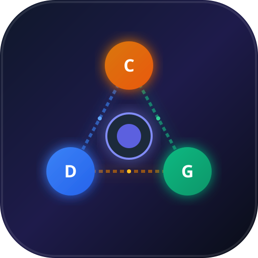

# 🚀 AI Omni Hub — Claude, DeepSeek, Gemini без VPN и без ключей в России

Универсальный веб-сайт и приложение для комфортной работы с лучшими мировыми нейросетями в России **без необходимости включать VPN и без покупки платных API-ключей**.



---

## 🌟 Ключевые возможности

1. **✨ Полностью БЕСПЛАТНО и БЕЗ КЛЮЧЕЙ**:
   - Никаких настроек и покупки платных зарубежных API-ключей не требуется.
   - Всё работает сразу «из коробки» на русском языке.

2. **📸 Анализ фото и скриншотов (Vision)**:
   - **Скидывайте любые фото, картинки, графики и скриншоты** напрямую в чат!
   - Кнопка **«Скинуть фото»** (📎), поддержка перетаскивания файлов мышью (**Drag & Drop**) и мгновенная вставка скриншота из буфера обмена (**Ctrl + V**).
   - Нейросеть распознает текст с фото, объясняет формулы, находит ошибки в коде на скриншотах и решает задачи.

3. **🔑 Быстрая авторизация через Яндекс ID и Google**:
   - Официальный вход через **Яндекс ID** (с красной кнопкой «Я») или **Google**.
   - Сохранение истории диалогов, избранных ролей и настроек.

4. **🤖 Три лучшие нейросети в одном окне**:
   - **🟣 Claude 3.7 / 3.5 Sonnet (Anthropic)** — топовый программист, логик и редактор текстов.
   - **🔵 DeepSeek R1 (Reasoning) & V3** — мыслящая модель с разворачиваемым блоком хода мыслей.
   - **🟢 Gemini 2.0 Flash & 1.5 Pro (Google)** — сверхбыстрый отклик и контекст до 2 млн токенов.

---

## ⚡ Как запустить

Папка проекта: `C:\Users\Admin\.gemini\antigravity\scratch\ai-omni-hub`

### Вариант 1. Запустить как приложение Windows
Дважды кликните по файлу:
```bat
start-app.bat
```
Приложение откроется в отдельном окне без лишних рамок браузера — полноценная настольная программа!

### Вариант 2. Запустить как веб-сайт в браузере
Дважды кликните по файлу:
```bat
start-web.bat
```
Или откройте в браузере: **`http://localhost:3001`** *(сервер уже запущен прямо сейчас!)*

---

## 📸 Как скидывать фото:

- **Способ 1:** Нажмите кнопку **«Скинуть фото»** рядом со строкой ввода и выберите файлы.
- **Способ 2:** Сделайте скриншот (например, через `Win + Shift + S`) и просто нажмите **`Ctrl + V`** в поле ввода.
- **Способ 3:** Перетащите файл картинки мышью прямо на область чата.
- Нажмите на миниатюру отправленной картинки, чтобы рассмотреть её в полном размере на весь экран.
